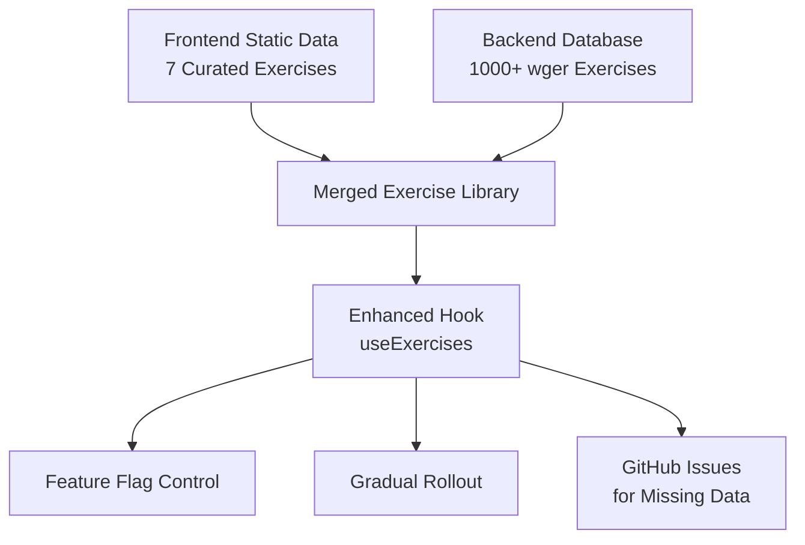

# Exercise Data Migration Documentation

## Overview

This document describes the comprehensive migration from static/hardcoded exercise data in the frontend to live data from the backend Supabase database. The migration preserves all existing UI/UX while expanding the exercise library from 7 curated exercises to 1000+ exercises from the wger fitness database.

## Migration Goals

- ✅ **Preserve Existing UI/UX**: No breaking changes to current user experience
- ✅ **Maintain Original Exercises**: Keep all 7 curated frontend exercises exactly as-is
- ✅ **Expand Exercise Library**: Add 1000+ exercises from backend database
- ✅ **Gradual Rollout**: Controlled deployment with feature flags
- ✅ **Quality Assurance**: Automated testing and monitoring
- ✅ **Data Enrichment**: Automated GitHub issues for missing data

## Architecture Overview

### Data Sources

1. **Frontend Static Data** (`data/exercises.ts`)
   - 7 curated exercises with rich metadata
   - High-quality cover images and videos
   - Detailed instructions, benefits, and equipment lists
   - **Preserved exactly** - no modifications

2. **Backend Database** (Supabase)
   - 1000+ exercises from wger fitness API
   - Basic exercise information (name, muscle, equipment, description)
   - **Enhanced gradually** with missing data fields

### Migration Strategy

**Preserve + Expand Approach**: Original frontend exercises remain untouched, backend exercises are added as additional entries.



## Implementation Details

### 1. Feature Flag System (`services/featureFlags.ts`)

```typescript
// Key feature flags
export const FEATURE_FLAGS = {
  ENABLE_BACKEND_EXERCISES: 'enable-backend-exercises',      // Load backend data
  SHOW_DATA_SOURCE_INDICATORS: 'show-data-source-indicators', // Debug mode
  AUTO_CREATE_GITHUB_ISSUES: 'auto-create-github-issues',     // Missing data tracking
  ENABLE_PERCENTAGE_ROLLOUT: 'enable-percentage-rollout',     // Gradual rollout
  DEBUG_EXERCISE_MERGING: 'debug-exercise-merging'           // Development debugging
};
```

**Usage:**
```typescript
// Enable backend exercises for 5% of users
localStorage.setItem('ff_ENABLE_BACKEND_EXERCISES', 'true');
localStorage.setItem('ff_ENABLE_PERCENTAGE_ROLLOUT', 'true');
localStorage.setItem('VITE_ROLLOUT_PERCENTAGE', '5');
```

### 2. Enhanced Exercise Types (`types/exercise.ts`)

```typescript
interface ExerciseWithSource extends Exercise {
  // Migration metadata
  dataSource: 'frontend' | 'backend' | 'merged';
  isOriginal?: boolean;  // Marks original 7 exercises

  // Quality metrics
  quality: {
    hasVideo: boolean;
    hasInstructions: boolean;
    hasBenefits: boolean;
    completeness: number; // 0-100%
  };

  // Backend specific fields
  libraryId?: string;
  category?: string;
  primaryMuscle?: string;
  secondaryMuscles?: string[];
}
```

### 3. Enhanced Exercise Hook (`hooks/useExercises.ts`)

**Key Features:**
- **Intelligent Merging**: Combines frontend + backend data
- **Duplicate Prevention**: Frontend exercises take precedence
- **Quality Assessment**: Calculates completeness scores
- **Cache Management**: 24-hour cache with automatic refresh
- **Fallback Logic**: Graceful degradation for missing data

```typescript
const {
  exercises,           // Enhanced exercises with source info
  loading,             // Loading state
  lastSync,           // Last cache refresh
  refresh,            // Manual refresh function
  migrationStats,     // Migration statistics
  missingDataInfo,    // Missing data for GitHub issues
  config              // Current configuration
} = useExercises();
```

### 4. GitHub Issues Automation (`services/githubIssues.ts`)

**Automatically creates issues for:**
- Missing videos
- Missing instructions
- Missing benefits
- Missing images
- Incomplete metadata

**Issue Template:**
- Priority-based labeling
- Structured data requirements
- Acceptance criteria
- Bulk creation support

### 5. Rollout Configuration (`config/rolloutConfig.ts`)

**6-Phase Rollout Strategy:**

1. **Phase 1** - Development Only (0%)
   - Backend exercises disabled
   - Data source indicators enabled

2. **Phase 2** - Internal Testing (1%)
   - Internal team testing
   - GitHub issues enabled

3. **Phase 3** - Limited Rollout (5%)
   - Small user group
   - Monitoring enabled

4. **Phase 4** - Expanded Rollout (25%)
   - Larger user base
   - Performance monitoring

5. **Phase 5** - Majority Rollout (75%)
   - Most users
   - Feature stability confirmed

6. **Phase 6** - Full Rollout (100%)
   - All users
   - GitHub issues disabled

### 6. Component Updates

#### ExerciseLibraryModal (`components/ExerciseLibraryModal.tsx`)
- **Data Source Indicators**: Development-only visual indicators
- **Migration Stats**: Real-time exercise count display
- **Backward Compatibility**: Maintains existing Exercise interface

#### ExerciseDetailModal (`components/ExerciseDetailModal.tsx`)
- **Missing Data Warnings**: Clear indication of incomplete exercises
- **Fallback Images**: Unsplash photos for exercises without images
- **Graceful Degradation**: Fallback messages for missing steps/benefits

## Environment Configuration

### Required Environment Variables (`.env.example`)

```bash
# Feature Flags
VITE_FF_ENABLE_BACKEND_EXERCISES=false
VITE_FF_SHOW_DATA_SOURCE_INDICATORS=false
VITE_FF_AUTO_CREATE_GITHUB_ISSUES=true
VITE_FF_ENABLE_PERCENTAGE_ROLLOUT=false
VITE_ROLLOUT_PERCENTAGE=0

# GitHub Configuration (for automated issues)
GITHUB_TOKEN=your_github_token_here
GITHUB_OWNER=your_github_owner_here
GITHUB_REPO=your_github_repo_here

# Supabase Configuration
NEXT_PUBLIC_SUPABASE_URL=your_supabase_url_here
NEXT_PUBLIC_SUPABASE_ANON_KEY=your_supabase_anon_key_here
```

## Testing Strategy

### Unit Tests (`tests/exercise-migration.test.ts`)

**Coverage:**
- Exercise data merging logic
- Feature flag behavior
- Quality assessment algorithms
- Rollout configuration
- User targeting logic

### E2E Tests (`tests/playwright/exercise-migration-ui.spec.ts`)

**Coverage:**
- UI consistency across data sources
- Feature flag toggling
- Responsive behavior
- Video/media handling
- Search and filtering

### Running Tests

```bash
# Unit tests (requires Vitest setup)
npm install -D vitest @vitest/ui jsdom
npm run test

# E2E tests (already configured)
npm run test:e2e

# Visual regression tests
npm run test:e2e -- --update-snapshots
```

## Deployment Strategy

### Phase 1: Infrastructure Deployment (Days 1-2)
1. Deploy with feature flags OFF
2. Verify no impact on existing functionality
3. Enable development testing

### Phase 2: Internal Testing (Days 3-4)
1. Enable backend exercises for internal team
2. Validate data merging logic
3. Create initial GitHub issues for missing data

### Phase 3: Gradual Rollout (Days 5-7)
1. Enable for 5% of users
2. Monitor performance metrics
3. Collect user feedback
4. Advance rollout phases based on metrics

### Phase 4: Full Rollout (Days 8+)
1. Complete rollout to all users
2. Disable GitHub issues
3. Optimize performance
4. Monitor long-term stability

## Monitoring and Success Metrics

### Technical Metrics
- **Performance**: <200ms load time with 1000+ exercises
- **Cache Hit Rate**: >90% for frequently accessed exercises
- **Error Rate**: <0.1% for backend data loading
- **Zero Regressions**: All existing UI/UX preserved

### Business Metrics
- **Exercise Library Growth**: 7 → 1000+ exercises
- **User Engagement**: Track exercise selection patterns
- **Data Completeness**: GitHub issues created/resolved
- **Rollout Success**: Smooth percentage-based deployment

### Monitoring Setup
```typescript
// Migration statistics available in real-time
const { migrationStats } = useExercises();
console.log(`Library: ${migrationStats.totalMergedExercises} exercises`);
console.log(`Complete: ${migrationStats.dataCompleteness.complete} exercises`);
```

## Rollback Strategy

**Immediate Rollback (1 minute):**
```typescript
// Disable backend exercises instantly
localStorage.setItem('ff_ENABLE_BACKEND_EXERCISES', 'false');
// OR
import.meta.env.VITE_FF_ENABLE_BACKEND_EXERCISES = 'false';
```

**Safe Rollback Guarantees:**
- Frontend exercises never modified
- Zero data loss
- Instant feature flag control
- Complete UI restoration

## Data Quality Management

### Missing Data Tracking

The system automatically tracks and creates GitHub issues for:
- **Critical**: Missing videos for popular exercises
- **High Priority**: Missing detailed instructions
- **Medium Priority**: Missing benefits and metadata
- **Low Priority**: Missing images and calorie data

### GitHub Issue Templates

Structured issues include:
- Exercise identification
- Missing field specification
- Acceptance criteria
- Quality guidelines
- Data requirements

### Data Enrichment Process

1. **Automated Detection**: System identifies missing data
2. **Issue Creation**: GitHub issues automatically generated
3. **Community Contribution**: Structured templates for contributions
4. **Quality Review**: Automated and manual validation
5. **Data Integration**: Seamless backend updates

## Troubleshooting

### Common Issues and Solutions

#### Backend Exercises Not Loading
```bash
# Check feature flags
localStorage.getItem('ff_ENABLE_BACKEND_EXERCISES')

# Verify Supabase configuration
console.log(import.meta.env.VITE_SUPABASE_URL)

# Check network connectivity
navigator.onLine
```

#### Missing Data Warnings
```typescript
// Check data quality
const { missingDataInfo } = useExercises();
console.log('Missing data:', missingDataInfo);
```

#### Performance Issues
```typescript
// Monitor cache performance
const cacheKey = 'fitness_exercises_cache_v2';
const cached = localStorage.getItem(cacheKey);
console.log('Cache age:', Date.now() - JSON.parse(cached).ts);
```

#### Feature Flags Not Working
```typescript
// Debug feature flag system
import { getEnabledFeatureFlags } from '../services/featureFlags';
console.log('Active flags:', getEnabledFeatureFlags());
```

## Future Enhancements

### Planned Improvements
1. **Smart Matching**: Advanced exercise matching algorithms
2. **User Preferences**: Personalized exercise recommendations
3. **Performance Analytics**: Exercise usage and popularity tracking
4. **Offline Support**: Enhanced offline exercise access
5. **Multi-language**: Internationalization support

### Scalability Considerations
- **Database Optimization**: Indexed queries for large exercise sets
- **CDN Integration**: Media delivery optimization
- **Progressive Loading**: Infinite scroll for large libraries
- **Caching Strategy**: Multi-layer caching for performance

## Conclusion

This migration successfully expands the fitness app's exercise library from 7 to 1000+ exercises while maintaining the high-quality curated user experience. The feature flag-controlled rollout ensures safe deployment with immediate rollback capabilities, and the automated issue tracking system continuously improves data quality.

The architecture is designed for:
- **Zero Downtime Deployment**
- **Gradual Feature Rollout**
- **Data Quality Assurance**
- **User Experience Preservation**
- **Long-term Scalability**

This migration provides a solid foundation for future fitness app enhancements while delivering immediate value through a dramatically expanded exercise library.